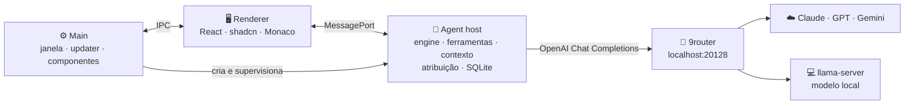

<div align="center">

# ⌘ JustToCode

### Agentes de código com contexto sob controle.

Um app desktop para trabalhar com agentes de IA no seu código — vendo **o que mudou**, **o que foi enviado** e **quanto contexto sobrou**, em tempo real.

<br>


[Por quê](#-por-quê) · [Recursos](#-recursos) · [Como funciona](#-como-funciona) · [Roadmap](#-roadmap) · [Desenvolvimento](#-desenvolvimento)

</div>

---

## 💡 Por quê

Agentes de código no terminal são poderosos, mas cegos para quem os usa:

- 🙈 **Você não vê o que está acontecendo.** Quais arquivos mudaram? O print chegou mesmo ao modelo? O que exatamente foi enviado?
- 🎈 **O contexto cresce sem controle.** Sem saber a janela real do modelo, a compactação nunca dispara — sessões incham até ficarem lentas, caras e inúteis.

O **JustToCode** resolve os dois: uma interface visual em cima de uma engine própria que **sabe** o tamanho da janela, **mede** cada token e **compacta** antes do problema aparecer.

---

## ✨ Recursos

<table>
<tr>
<td width="50%" valign="top">

### 🗂️ Projetos e chats
Abra qualquer repositório git como projeto. Vários chats por projeto, **rodando ao mesmo tempo**, com histórico persistido localmente.

</td>
<td width="50%" valign="top">

### 🔍 Diff visual por chat
Painel de arquivos alterados com diff lado a lado (Monaco). Cada mudança carrega a **cor do chat** que a fez — por ferramenta, por comando ou por você. Aceite ou reverta com segurança, com merge de três vias quando outro chat mexeu depois.

</td>
</tr>
<tr>
<td valign="top">

### 📏 Contexto sob controle
Medidor em tempo real (`usados / janela`), **compactação automática** num resumo estruturado e incremental, truncamento de saídas longas de ferramentas e opção de resumir com o **modelo local**. Você vê quando e por que compactou.

</td>
<td valign="top">

### 🧾 Transparência total
Thumbnails que confirmam que o anexo foi enviado e um **inspetor de payload** que mostra o JSON exato de cada request, as instruções carregadas e os tokens estimados vs. reportados.

</td>
</tr>
<tr>
<td valign="top">

### 🔀 Qualquer modelo, via 9router
Fala com o [9router](https://github.com/decolua/9router) — Claude, GPT, Gemini e modelos locais atrás de **combos com fallback**. A janela efetiva considera o menor membro da combo, e o app avisa quando o modelo muda no meio da conversa.

</td>
<td valign="top">

### 🛡️ Permissões que não travam
Caixa de aprovações por chat, que não bloqueia os outros. Modos *pedir*, *editar livre* e *permitir tudo*, regras por projeto e comandos perigosos que sempre confirmam.

</td>
</tr>
<tr>
<td valign="top">

### 🧩 Ecossistema de agentes
Carrega `AGENTS.md` / `CLAUDE.md`, **skills** (`SKILL.md`), **slash commands** e **subagents** — o mesmo fluxo que você já usa em outras ferramentas.

</td>
<td valign="top">

### 🧰 Tudo pela interface
Instala, atualiza, inicia e para o 9router e o `llama-server`; baixa modelos GGUF com escolha de quantização e aviso de VRAM/RAM. E o próprio app **se atualiza com um clique**, mostrando o changelog.

</td>
</tr>
</table>

---

## 🧠 Como funciona



- **Engine própria** em TypeScript: o loop do agente, a política de compactação e a atribuição de mudanças ficam sob controle total — não escondidos dentro de um SDK.
- **Histórico canônico** no formato OpenAI, reenviado a cada request: se a combo trocar de Claude para GPT no meio da conversa, nada se perde.
- **Agent host isolado** num `utilityProcess`: um turno pesado nunca congela a janela, e um crash é recuperado sozinho.
- **Mesma working tree, vários chats:** cada escrita e cada comando tiram uma "foto" do estado git antes e depois, então o app sabe quem mudou o quê.

---

## 🗺️ Roadmap

| Fase | Entrega | Status |
|:---:|---|:---:|
| **0** | Fundação: app empacotado, banco local, auto-update por tag, testes de integração com o 9router | 🚧 |
| **1** | Ver o que acontece: projetos, chat com ferramentas, diff, permissões, anexos, inspetor de payload, medidor | ⏳ |
| **2** | Contexto sob controle: janela efetiva por combo, compactação automática e incremental, resumo local | ⏳ |
| **3** | Paralelo e ecossistema: chats simultâneos, atribuição por chat, revert de três vias, skills, subagents, mensagem de commit | ⏳ |
| **4** | Componentes: 9router, llama.cpp e modelos GGUF gerenciados pela interface | ⏳ |

---

## 🛠️ Desenvolvimento

> O código ainda está sendo construído (Fase 0). Os comandos abaixo passam a valer quando o esqueleto do app chegar.

**Pré-requisitos:** Windows 11 · Node.js 22+ · Git · [9router](https://github.com/decolua/9router) rodando em `http://localhost:20128`

```bash
npm install        # instala dependências e recompila módulos nativos para o Electron
npm run dev        # abre o app em modo desenvolvimento
npm test           # testes (rodam no Node do Electron)
npm run dist       # gera o instalador Windows em dist/
```

### Publicando uma versão

```bash
npm run release -- 0.1.0
```

Sobe a versão, cria a tag `v0.1.0` e faz o push. O GitHub Actions compila o instalador e publica a Release — e o app instalado mostra **"v0.1.0 disponível"** com o changelog.

---

## 🧱 Stack

**Electron** · **electron-vite** · **electron-builder** · **electron-updater** · **React 18** · **TypeScript** · **Tailwind** · **shadcn/ui** · **Monaco** · **better-sqlite3** · **openai** · **js-tiktoken** · **ripgrep** · **Vitest** · **Playwright**

---

<div align="center">

Feito para uso pessoal, com ☕ e muitos tokens bem contados.

</div>
